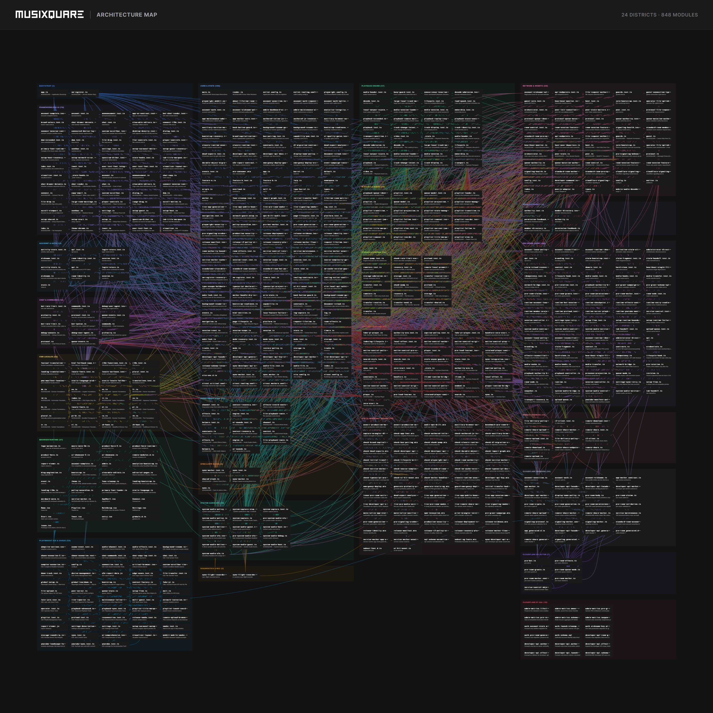

<p align="center">
  <a href="https://musixquare.com">
    
  </a>
</p>

<p align="center">
  <strong>Multi-Device Synchronized Audio System</strong>
</p>

<p align="center">
  <a href="https://musixquare.com">musixquare.com</a> &bull;
  <a href="https://musixquare.com/about">About</a> &bull;
  <a href="https://musixquare.com/history">History</a> &bull;
  <a href="https://musixquare.com/designsystem">Design System</a> &bull;
  <a href="https://github.com/hiefny/MUSIXQUARE">GitHub</a>
</p>

---

## Overview

MUSIXQUARE transforms smartphones, tablets, and desktop computers into a zero-installation, synchronized multi-speaker wireless sound system. 

By combining low-latency Web Audio DSP graphs, peer-to-peer WebRTC data/media transports, and Cloudflare distributed edge actors (Durable Objects, D1, R2), MUSIXQUARE enables real-time collaborative listening, spatial speaker role mapping, YouTube Together synchronization, and desktop system audio streaming across heterogeneous hardware.

---

## Product Demo

[](https://youtu.be/VbFwgt4l3Gc?si=_i8eQa4kiDWl8kv5)

*Click the image above to watch the official MUSIXQUARE demonstration video on YouTube.*  
**Direct Video Link:** [https://youtu.be/VbFwgt4l3Gc](https://youtu.be/VbFwgt4l3Gc?si=_i8eQa4kiDWl8kv5)

---

## System Architecture

The MUSIXQUARE architecture is organized into **24 specialized functional districts** spanning **848 modules** and **3,021 dependency edges**.

<p align="center">
  
</p>

### Architecture Layout Breakdown

| Column | Layer | Districts Included | Focus & Responsibilities |
| :--- | :--- | :--- | :--- |
| **Col 1** | **Client & Runtime** | `BOOTSTRAP`, `FRAMEWORKLESS UI`, `ACCOUNT & AUTH`, `CHAT & COMMANDS`, `I18N LOCALES`, `BROWSER RUNTIME`, `PLAYWRIGHT E2E & CHAOS` | Micro-bundle hydration, reactive vanilla DOM rendering, locale pluralization, classic runtime compatibility, and automated integration/chaos suites. |
| **Col 2** | **Core Audio Engine** | `CORE & STATE`, `AUDIO GRAPH & DSP`, `SYNC & NTP CLOCK`, `SYSTEM AUDIO SFU`, `DIAGNOSTICS & REC` | Web Audio node topology (5-band EQ, convolution reverb, stereo widener, virtual bass), host-relative RTT rolling clock sync, and desktop stereo SFU capture. |
| **Col 3** | **Media & Verification** | `PLAYBACK ENGINE`, `PLAYLIST & QUEUE`, `STORAGE & CHUNKS`, `YOUTUBE TOGETHER`, `STATIC INVARIANT GUARDS` | Track decoding, gapless state transition, queue management, chunked RAM-only storage, YouTube IFrame API synchronizer, and compile-time AST invariant guards. |
| **Col 4** | **Edge & Distributed Cloud** | `NETWORK & WEBRTC`, `ROOM AUTHORITY`, `PRO ROOM CLIENT`, `REMOTE SHARE R2`, `CLOUDFLARE WORKERS`, `CLOUDFLARE DO ACTOR`, `CLOUDFLARE D1 SQL` | Peer-to-peer data channels, stateful Durable Object session actors, persistent PRO room authorization, Cloudflare D1 relational schemas, and private R2 asset delivery. |

---

## Key Features

- **6-Digit Room Access**:
  - `100000` to `999999`: Temporary Standard Rooms hosted entirely in-browser over direct WebRTC data channels.
  - `000000` to `099999`: Persistent PRO Rooms backed by dedicated Cloudflare Durable Object actors with durable state and multi-device persistence.
- **Dynamic Speaker Role Routing**:
  - Assign connected devices in real time to **Center (Stereo)**, **Left Channel**, **Right Channel**, or **Subwoofer (Low-pass filtered)**.
- **Hardware-Accelerated Web Audio DSP**:
  - In-browser 5-band parametric equalizer, convolution reverb engine, Haas stereo widener, and virtual psychoacoustic bass enhancer.
- **Sub-Millisecond Clock Synchronization**:
  - Standard rooms utilize rolling host-relative RTT probing; PRO rooms operate via server-coordinated epoch timelines with two-phase prepare/commit rendezvous scheduling.
- **YouTube Together Synchronization**:
  - Synchronized playback across heterogeneous network topologies with automatic drift detection, seek compensation, and buffering state alignment.
- **Desktop System Audio Streaming (Beta)**:
  - Low-latency tab or system audio broadcast from desktop Chromium browsers to up to 4 concurrent client devices.
- **Private Media & Queue Management**:
  - In-memory RAM audio pipeline for standard rooms and private Cloudflare R2 chunked storage for persistent PRO rooms.
- **Localized UI**:
  - Built-in support for 17 languages with zero external dependencies.

---

## Room Types Comparison

| Attribute | Standard Room | Persistent PRO Room |
| :--- | :--- | :--- |
| **Code Range** | `100000` - `999999` | `000000` - `099999` |
| **Lifecycle** | Temporary; terminates when browser host departs | Persistent across empty-room sleep/wake cycles |
| **Password** | Optional 8-digit access PIN | Required 8-digit room password |
| **Authority Model** | Browser host authoritative over WebRTC P2P | Cloudflare Durable Object server-authoritative state |
| **Storage Backend** | Ephemeral browser RAM / Direct WebRTC stream | Private Cloudflare R2 bucket (1 GiB / room, 200 MiB / file) |
| **Presence Model** | Host-managed peer roster | Server-tracked heartbeats and participant session recovery |

---

## Technology Stack

- **Frontend Core**: TypeScript (Strict Mode), Vite, HTML5 Web Audio API, WebRTC (RTCDataChannel, RTCPeerConnection), Native Web Components.
- **Signaling & Edge Backend**: Cloudflare Workers, Cloudflare Durable Objects (Stateful Actors), Cloudflare D1 (Serverless SQL), Cloudflare R2 (Object Storage).
- **Transport Adapters**: Cloudflare TURN / STUN infrastructure, PeerJS local development adapter.
- **Quality & Verification**: Vitest, Playwright E2E with network throttling and packet loss simulation, Custom TypeScript AST invariant linters.

---

## Local Development

### Prerequisites

- **Node.js**: `24.13.1` (enforced via [`.node-version`](./.node-version))
- **Package Manager**: `npm@11.8.0` (managed via Corepack)

### Installation & Startup

```bash
corepack npm ci
npm run dev
```

Open `http://localhost:3000` in your browser.

Local development runs entirely on the browser-only PeerJS transport by default and requires no external Cloudflare credentials or API keys.

### Test & Verification Pipeline

```bash
# Run unit and integration tests
npm test

# Run strict TypeScript compiler verification
npm run typecheck

# Run codebase linter
npm run lint

# Verify Cloudflare Worker contracts and syntax
npm run check:workers

# Run full production build with invariant validation
npm run build:checked
```

---

## Security & Privacy Policy

- **Zero Credential Exposure**: Public repository contains no secrets, private keys, or credentials.
- **Fail-Closed Endpoints**: Backend routes reject unauthorized requests by default unless explicitly authenticated with scoped capability tokens.
- **Proof-of-Work Rate Limiting**: Token minting utilizes short-lived proof-of-work challenges to safeguard against resource exhaustion.
- **RAM-Only Browser Media**: Decoded audio buffers and streamed media chunks remain in volatile memory and are not persisted to unencrypted local storage.

---

## License

Copyright (c) 2025-2026 MUSIXQUARE.

MUSIXQUARE is open-source software licensed under the **GNU Affero General Public License v3.0 or later** ([AGPL-3.0-or-later](./LICENSE)).

### Third-Party Notices

- **PeerJS**: MIT License
- **qrcode & content-shield**: MIT License (see [THIRD-PARTY-NOTICES.md](./THIRD-PARTY-NOTICES.md))
- **Google Material Icons**: Apache License 2.0 (see [distributed license](./public/licenses/material-icons-apache-2.0.txt))
- **Pretendard Font**: SIL Open Font License 1.1 (see [PRETENDARD_LICENSE.txt](./fonts/PRETENDARD_LICENSE.txt))
- **Noto Sans Fonts**: SIL Open Font License 1.1 (see [NOTO_SANS_LICENSE.txt](./fonts/NOTO_SANS_LICENSE.txt))
