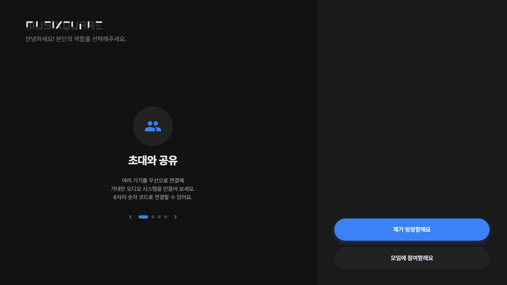
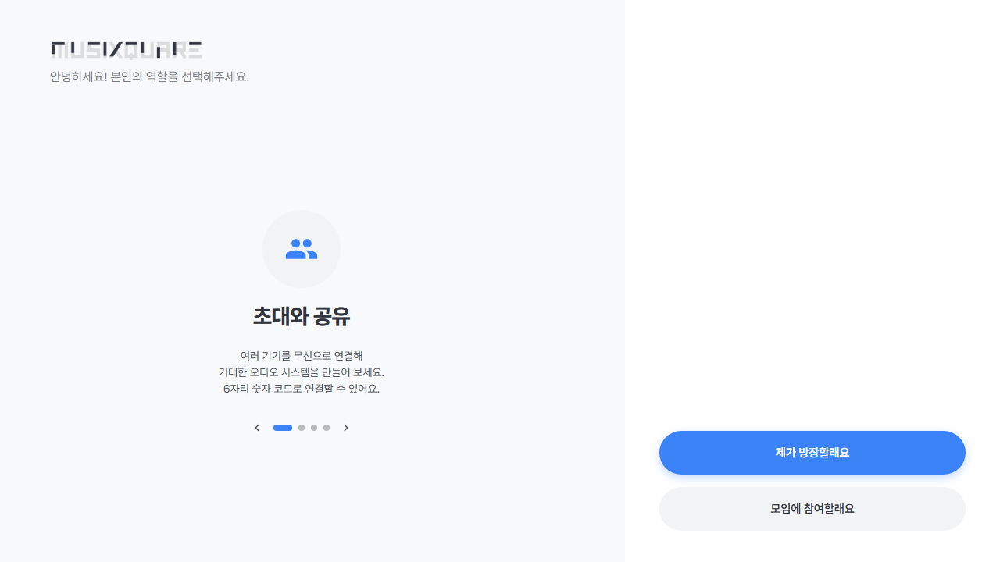
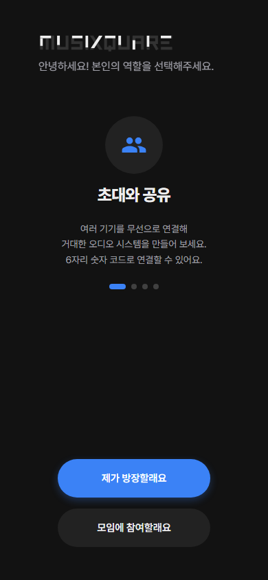
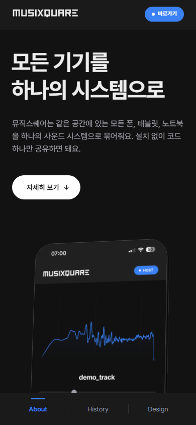

# CSS Cleanup - 2026-05-30

> **Historical snapshot.** This records the CSS cleanup and browser captures
> made on 2026-05-30. Line counts, selectors, and verification results are tied
> to that revision and are not claims about the current stylesheet.

## Scope

Target file: `css/style.css`

- Before: 7805 lines
- After: 7771 lines
- Net reduction: 34 lines

This pass intentionally kept dynamic selectors unless there was clear evidence they are not produced by `index.html`, `.workshop/**/*.html`, or `src/**/*.ts`.

## Removed Selectors

### `#btn-logo-help`

Evidence:

- No `id="btn-logo-help"` in `index.html`.
- No `btn-logo-help` reference in `src/**/*.ts`.
- No `btn-logo-help` reference in `.workshop/**/*.html`.
- The live compact help button is `#btn-help-compact` in `index.html` and `src/ui/tabs.ts`.

Removed rule:

```css
#btn-logo-help {
  display: none !important;
}
```

### `.settings-section:last-child`, `.guide-section:last-child`

Evidence:

- No `settings-section` reference in `index.html`.
- No `guide-section` reference in `index.html`.
- No `settings-section` or `guide-section` reference in `src/**/*.ts`.
- No `settings-section` or `guide-section` reference in `.workshop/**/*.html`.

Removed rule:

```css
.settings-section:last-child,
.guide-section:last-child {
  margin-bottom: 0 !important;
  padding-bottom: 8px !important;
}
```

## Kept As Dynamic

### `.chat-badge-host`, `.chat-badge-op`

These looked unused in a plain exact-token selector scan, but they are generated dynamically by `src/ui/chat-render.ts`:

```ts
crown.className = `chat-badge-${badge}`;
```

The CSS rules were kept.

## Consolidations

- Moved `display: block` into the canonical `input[type='range']` rule and removed the later duplicate range reset block.
- Removed the duplicate `.onboarding-card { overflow: hidden; }` block because the canonical `.onboarding-card` rule already sets the same property.
- Merged adjacent `.header-right.header-default-content` tablet-sidebar rules.
- Folded the duplicate `.tab-content.active { padding-bottom: 8px !important; }` override into the main tablet-sidebar shorthand padding.
- Moved the super-compact `.bottom-nav` vertical-centering `top` value into the existing super-compact `.bottom-nav` block.
- Replaced repeated primary-blue shadow literals with the existing custom property:

```css
rgba(59, 130, 246, X) -> rgba(var(--primary-rgb), X)
```

## Verification

### Build

`npm run build` passed.

Notes:

- Vite still reports the pre-existing `src/player/playlist.ts` dynamic/static import chunk warning.
- Vite still reports the pre-existing large chunk warning.

### Browser Smoke

Checked `http://127.0.0.1:3000/` through the in-app browser and confirmed the app route loads with title `MUSIXQUARE · 뮤직스퀘어`.

Playwright screenshots were captured against the same dev server:

- Main app, desktop, dark: `docs/css-cleanup-2026-05-30/app-desktop-dark.png`
- Main app, desktop, light: `docs/css-cleanup-2026-05-30/app-desktop-light.png`
- Main app, mobile, dark: `docs/css-cleanup-2026-05-30/app-mobile-dark.png`
- Main app, mobile, light: `docs/css-cleanup-2026-05-30/app-mobile-light.png`
- `/about`, desktop/mobile: `about-desktop.png`, `about-mobile.png`
- `/privacy`, desktop/mobile: `privacy-desktop.png`, `privacy-mobile.png`
- `/terms`, desktop/mobile: `terms-desktop.png`, `terms-mobile.png`
- `/faq`, desktop/mobile: `faq-desktop.png`, `faq-mobile.png`

Representative screenshots:









No visual overlap, missing controls, or obvious layout collapse was observed in the captured desktop/mobile smoke set.
