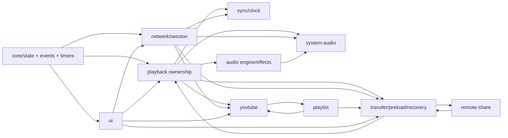

# MUSIXQUARE Full Project Audit

Audit baseline: `e278f1e` (`docs: explain FILE-only invariant in lifecycle mode/activity derivation`) on branch `codex/playback-ownership-refactor`.

Comparison baseline for the playback refactor: `ec18221..HEAD`.

Audit date: 2026-05-12.

This audit is diagnostic only. Runtime code was not changed as part of the audit; this document is the deliverable.

## Executive Summary

The refactor succeeded at the main structural goal: production code no longer depends on the old flat `appState` slot or `APP_STATE` enum. Playback state now has a clearer two-axis contract:

- `playback.mode`: `file | youtube | system-audio | null`
- `playback.activity`: `idle | paused | playing | pending`
- `playback.lifecycle`: still the local-file pipeline FSM only
- `ownership.ts`: the compatibility and reconciliation boundary

The required verification gates passed:

| Command | Result | Notes |
| --- | --- | --- |
| `npm run typecheck` | PASS | Includes worker tsconfig. |
| `npm run lint` | PASS | `eslint src/`. |
| `npm test` | PASS | 58 test files, 800 tests. |
| `npm run build` | PASS | Known warnings only: Vite chunk-size and `playlist.ts` mixed static/dynamic import. |

The static audit found no confirmed `Critical` or `High` open defect. The remaining risk is mostly in runtime-only or cross-device surfaces where jsdom/unit tests cannot prove behavior:

- system-audio SFU/P2P adapter switching
- remote-share / preload / main-transfer collision scenarios
- YouTube iframe real-state ordering, ads, buffering, and rendezvous calibration
- mobile background/lock-screen return
- real-device WebRTC timing and browser audio policy

The project is still complex, but the refactor made the complexity more inspectable. The main improvement is not that future bugs become impossible; it is that future bugs should be easier to localize to a contract boundary.

## Baseline

`ec18221..HEAD` includes:

- 67 files changed
- 2592 insertions
- 866 deletions
- refactor and test commits that remove `state.appState`, remove legacy `APP_STATE`, move sync wire payloads to mode/activity, harden system-audio cleanup, and document the ownership contract

Important survey results:

- Production `src` has no direct `APP_STATE`, `appState`, `getState('appState')`, `setState('appState')`, or `state:appState` references.
- Production `src` has no broad `as any`, `@ts-ignore`, or `@ts-expect-error` holdouts from this audit search.
- `docs/state-patterns.md` defines consumption patterns.
- `docs/appstate-decomposition.md` records the completed appState decomposition.
- `src/core/__tests__/type-escape-holdouts.test.ts` and `src/player/__tests__/playback-state-contract.test.ts` pin important regression constraints.

## Domain Map

| Domain | Main Files | State Ownership | Events And Protocol | External Dependencies | Cleanup Paths | Highest-Risk Race |
| --- | --- | --- | --- | --- | --- | --- |
| Core runtime | `src/core/state.ts`, `events.ts`, `timers.ts`, `page-lifecycle.ts`, `background-resume-guard.ts`, `blob-manager.ts` | Owns central state tree, typed state events, managed timers, lifecycle guards. | Emits `state:*`, lifecycle cleanup, background recovery callbacks. | DOM visibility, History API, Wake Lock through bootstrap callers. | `resetState`, `clearAllManagedTimers`, `BlobURLManager.revokeAllNow`, page lifecycle leave hooks. | Re-entrant state events during `batchSetState`; long background resume while media and network are both mid-transition. |
| Playback ownership | `src/player/ownership.ts`, `transport.ts`, `playback.ts`, `decode.ts`, `lifecycle.ts`, `video.ts`, `media-session.ts` | Owns `playback.mode/activity`, `playback.lifecycle`, playback source helpers, and compatibility predicates. | Emits/consumes `player:*`, `playback:*`, `state:playback.*`, `storage:*`, `youtube:*`, `system-audio:*`. | Web Audio buffer nodes, Media Session API. | `stopAllMedia`, `setPlaybackIdle`, lifecycle failed/idle transitions. | Silent track transition keeps UI mode visible while lifecycle is not audible; `SYNC_PONG` must expose the paused shadow. |
| Playlist | `src/player/playlist.ts`, `src/ui/playlist-view.ts` | Reads playlist list/current index/repeat/shuffle; calls playback/youtube/storage entrypoints. | Emits `playlist:*`, `youtube:*`, `storage:*`, `ui:switch-tab`. | DOM list rendering, local File objects. | `clearPreloadState`, remove/empty handlers. | Rapid next/prev across file and YouTube while preload or decode is still pending. |
| Audio engine/effects | `src/audio/engine.ts`, `effects.ts`, `channel.ts`, `beat-detector.ts` | Owns audio graph nodes and audio settings. Reads playback mode/activity for graph refresh and beat state. | Emits `audio:*`, `beat:pulse`, UI sync events. | Tone/Web Audio, analyzer, BPM analyzer. | Graph disconnects, `audio:disconnect-surround`, reset effect handlers. | Mutating the graph while playback owner changes or buffer swaps silently. |
| System audio | `src/audio/system-capture.ts`, `src/network/system-audio-host.ts`, `system-audio-guest.ts`, `system-audio-sfu.ts`, `peer.ts` media-call branch | Host claims system-audio owner; guest uses placeholder meta, `systemAudio.isReceiving`, and shared cleanup. | `SYSTEM_AUDIO_START`, `SYSTEM_AUDIO_STOP`, `SYSTEM_AUDIO_SFU_READY`, `system-audio:*`. | `getDisplayMedia`, WebRTC MediaConnection, Cloudflare Realtime SFU, Web Audio MediaStream nodes. | `stopSystemAudioCapture`, `cleanupGuestSystemAudio`, `cleanupHostSfu`, `cleanupGuestSfu`, `system-audio:force-stop`. | SFU receive arriving, local P2P media call arriving, or connection reclassification all racing over the same receive ownership. |
| Network/session | `src/network/peer.ts`, `host.ts`, `guest.ts`, `peer-state.ts`, `orchestrator.ts`, `transport/*` | Owns role/session code/hostConn/connectedPeers/operator flags/connectionType/slots. | `network:*`, `orchestrator:*`, transport `data/open/close/error/call`. | PeerJS-compatible facade, Cloudflare signaling, WebRTC DataChannel, TURN fetch. | `leaveSession`, host close/error guards, guest hostConn close/error, peer destroy. | Old async close/error event clearing a newer connection or stale slot. Existing active-connection guards reduce this. |
| Sync/clock | `src/network/sync.ts`, `shared-clock.ts`, `sync-worker.ts`, `workers/sync.worker.ts` | Owns sync offset, latency history, ping counter, shared clock samples, heartbeat monitor. | `SYNC_PING`, `SYNC_PONG`, `sync:*`, `worker:timer-tick`, heartbeat peer cleanup. | Dedicated worker timer with main-thread fallback. | `resetSyncClockRuntime`, `stopWorkerTimer`, sessionCode/hostConn reset listeners. | Background throttling or worker failure starving guest pings; host heartbeat has a 120s hard cleanup window. Current fallback prevents the fatal path but is less precise. |
| Transfer/storage | `src/storage/transfer.ts`, `transfer-send.ts`, `transfer-receive.ts`, `preload.ts`, `storage.ts`, `recovery.ts`, `ramstore.ts` | Owns transfer/preload/recovery state, current blobs, session IDs, chunk buffers. | `FILE_*`, `PRELOAD_*`, `REQUEST_*`, `storage:*`, `remote-file:*`. | Indexed/ram storage abstraction, Blob/File, DataChannel. | Session reset, stale chunk counters, recovery request, preload abort, blob revoke. | Main transfer and preload transfer changing sessions while stale chunks arrive out of order. |
| Remote share | `src/share/remote-share.ts`, `remote-upload.ts` | Owns `share.remote.*` progress and remote descriptors; writes file track meta on accepted remote file. | `REMOTE_FILE_SHARE`, `REMOTE_FILE_UNAVAILABLE`, `share:remote-file`, `remote-file:*`. | Remote object storage endpoint, WebCrypto, fetch. | AbortController per upload/download, descriptor checks, sessionCode reset. | First remote encrypted file for a late guest finishing after host already played. Sync bootstrap now covers part of this, but e2e coverage is still the proof gap. |
| YouTube | `src/youtube/player.ts`, `sync.ts`, `iframe.ts`, `handlers.ts`, `search.ts`, `state.ts` | Owns YouTube runtime, sub-items cache, guest latency calibration; claims playback mode through ownership helpers. | `YOUTUBE_*`, `REQUEST_YOUTUBE_*`, `youtube:*`, playlist bridge events. | YouTube iframe API, fetch/search endpoints, timers. | `stopYouTubeMode`, `resetYouTubeSyncState`, rendezvous timer cleanup. | Real iframe state changes, buffering, ads, and host transitions overlapping rendezvous timers. |
| Chat/operator | `src/chat/protocol.ts`, `commands.ts`, `profanity.ts`, UI chat files | Owns chat moderation state under `network.*`; reads playback ownership for `/status`. | `CHAT_*`, `REQUEST_CHAT_COMMAND`, `chat:*`, `network:toggle-operator`. | DOM rendering, content filtering. | Rate bucket reset on peer disconnect, clear/freeze/mute commands. | OP command authorization is host-side; UI can optimistically differ from host if injected frames bypassed a guard. Current host-origin guards reduce this. |
| UI | `src/ui/*`, `css/style.css`, `index.html` | Reads state through subscriptions and command-time polls; owns dialogs/toasts/tabs/player controls. | `ui:*`, `state:*`, command events. | DOM, CSS, browser layout, media controls. | Scoped bus listeners, dialog teardown, custom scrollbar cleanup. | Display state and command state diverging during rapid mode transitions. `_state-hooks.ts` reduces stale-label risk. |
| i18n | `src/i18n/*` | Owns language setting and translation lookup. | `i18n:changed`. | localStorage/navigator language. | Re-render through subscribers. | Missing translation key in a new dialog or toast path. |
| Workers | `src/workers/sync.worker.ts`, `src/network/sync-worker.ts` | Worker owns timer loops; bridge owns active/fallback timer registry. | Worker messages: `START_TIMER`, `STOP_TIMER`, `TICK`, `WORKER_ERROR`. | Dedicated Worker API. | `handleSyncWorkerFailure`, `stopWorkerTimer`, test reset helper. | Worker startup/post failure. Current fallback is intentionally conservative and warns on long resume. |
| Tests/docs | `src/**/__tests__`, `e2e/*`, `docs/*` | Contract pinning and migration docs. | Vitest, Playwright. | jsdom, fake YouTube player, browser contexts. | Test resets and managed timer reset helpers. | E2E/manual gaps for hardware/browser-sensitive flows. |

## Cross-Domain Dependency Map

Key cross-domain contracts:

- Playback mode/activity is the display and command contract; lifecycle is only the local-file pipeline FSM.
- Network protocol validation happens centrally in `src/network/protocol.ts`, but origin authorization is still handler-local because only handlers know whether a message must be host-only, host-to-guest, or OP-only.
- Transfer and preload are separate session domains. A chunk is only meaningful when its `sessionId`, `index`, host origin, and local lifecycle agree.
- System-audio has two receive adapters, P2P and SFU, but `system-audio-guest.ts::cleanupGuestSystemAudio` owns placeholder/meta restoration.
- YouTube owns its own pause/playing runtime state through iframe APIs; `playback.mode/activity` only says the room is in YouTube mode.

## Contract Audit

### Playback State Contract

Status: healthy.

- `state.appState` and `APP_STATE` are gone from production code.
- Direct writes to `playback.mode/activity` are centralized in `ownership.ts`.
- UI display paths use subscription helpers where the display is state-derived.
- Strict legacy idle is represented only by `isPlaybackIdleCompat()`.
- `owner` and `mode` intentionally diverge for paused local-file playback: owner is `none`, mode is `file`.

Residual risk:

- New contributors must keep lifecycle writes routed through ownership helpers. The bus bridge in `ownership.ts` is a compatibility backstop, not a license for arbitrary source writes.

### Event Bus Contract

Status: mostly healthy.

- Event names are typed in `src/core/events.ts` and state events are typed through mapped state paths.
- `batchSetState` snapshots pending paths before emitting, protecting re-entrant state changes.
- UI scoped hooks exist for playback mode/activity display state.

Residual risk:

- Many modules register long-lived module-level listeners at bootstrap. This is normal for the app, but tests that call `bus.clear()` can remove global bridges and must re-import/reinitialize carefully.
- Some ordering dependencies are intentional but subtle: `player:stop-all-media` before new owner claim, YouTube stop before file handoff, SFU cleanup before P2P takeover.

### Network And Protocol Contract

Status: strong for known injection classes.

- `protocol.ts` validates high-risk payloads and rate-limits non-chunk inbound frames per peer.
- Guest-only trust paths guard `conn === hostConn` in `guest.ts`, `sync.ts`, `youtube/sync.ts`, `storage/*`, `remote-share.ts`, and system-audio handlers.
- OP commands are verified on the host using `verifyOperator`.
- System-audio media calls are accepted only from the connected host peer and only for known metadata types.
- Guest hostConn replacement resets shared clock runtime.

Residual risk:

- Validators are intentionally lightweight and not exhaustive for every message type. That is acceptable, but new high-risk messages must add validators at introduction time.
- Cross-version compatibility for old `SYNC_PONG.appState` was intentionally removed in this worktree. Same-version sessions are clean; mixed old/new deployment is a release-management risk, not a current code defect.

### Storage And Transfer Contract

Status: heavily guarded but still complex.

- FILE and PRELOAD handlers require host origin.
- Session IDs guard start/resume/chunk/end boundaries.
- Chunk size and total bounds exist in protocol validators.
- Stale chunk burst detection requests recovery rather than silently drifting forever.
- Remote share descriptors are tied to active session/index and encrypted object metadata.

Residual risk:

- The combined state machine spans `transfer-receive.ts`, `preload.ts`, `remote-share.ts`, `recovery.ts`, and playback decode. It is protected by many local guards, but the whole user journey needs more integration coverage.

### UI Contract

Status: improved.

- Display state for playback mode is now reactive through `_state-hooks.ts` and related subscriptions.
- Command handlers still poll fresh state where that is the correct pattern.
- Long background resume warning is integrated with the existing dialog path, including the sync-worker fallback-specific wording.

Residual risk:

- DOM visibility, disabled state, and toasts/dialogs are partly covered by jsdom and Playwright tests, but mobile/PWA/background browser behavior remains manual.

## Critical User Journey Replay

| Scenario | Expected Transition | Actual Code Path | Cleanup Guarantee | Test Coverage | Risk |
| --- | --- | --- | --- | --- | --- |
| Host starts file, guest joins late | Host sends current file/playlist state; guest receives file or remote descriptor, decodes, sync bootstrap starts near host position. | `host.ts` open -> `orchestrator:*` -> `playback.ts` late-join bootstrap -> transfer/recovery -> `sync:request-immediate-ping`. | Host close/error removes peer; leave clears transfer/sync/blob. | Unit tests for sync bootstrap, late-join playback payload, transfer; e2e has late-join suites. | Medium-low: real remote encrypted path still deserves e2e. |
| Remote guest receives encrypted remote-share first file | Descriptor must match active session/index; download/decrypt, promote to active blob, request immediate ping. | `remote-share.ts` -> `transfer-receive.ts` wait/promotion -> `storage:use-preloaded` or file-ready -> `sync.ts` bootstrap. | Abort controllers, unavailable messages, session reset listener. | `remote-share.test.ts`, storage tests. | Medium: integration of HTTP object storage + late sync is high-value test gap. |
| Host rapidly presses next/previous | Old timers and decode/load tokens must not claim ownership after newer track. | `playlist.ts` -> `stopAllMedia({ silent })` -> preload/decode token checks -> YouTube rendezvous cancel/debounce. | Managed timers cleared; load token guards; YouTube auto-sync timers cancel. | Playback, playlist, YouTube sync integration tests. | Medium-low: likely OK, but cross-mode rapid click e2e is valuable. |
| Preload in progress while main transfer changes session | Old preload chunks should remain scoped; main session should not be overwritten by stale chunks. | `preload.ts` sessionState/reorder buffers; `transfer-receive.ts` sessionId guards and stale burst recovery. | Preload abort/session bump, stale chunk counters reset on leave. | Preload and transfer unit tests. | Medium: no single full scenario test for preload/main collision. |
| YouTube -> local file | YouTube timers/runtime stop; file owns playback after decode. | `playlist.ts`/`transport.ts` emit `youtube:stop-mode`, `player:stop-all-media`, then file load/decode. | `stopYouTubeMode`, `resetYouTubeSyncState`, managed timer clears. | YouTube/player/playback tests. | Medium-low: real iframe can still deliver late state events. |
| Local file -> YouTube | File source stops; YouTube claims mode and starts rendezvous. | `youtube/player.ts` load path, `iframe.ts` ready/state, `ownership.ts` YouTube claim. | File node stop and YouTube reset on stop-mode. | YouTube integration tests, playback tests. | Medium-low. |
| System-audio placeholder start fails | Guest shows pending placeholder, then watchdog restores previous meta/idle. | `system-audio-guest.ts` `SYSTEM_AUDIO_START` -> placeholder -> receive watchdog -> `cleanupGuestSystemAudio`. | Shared cleanup restores meta, receiving state, playback idle. | `system-audio-guest.test.ts`. | Low-medium. |
| System-audio SFU -> P2P or P2P -> SFU switch | Only one receive adapter should own audio graph; cleanup should not erase the incoming adapter's state. | `system-audio-sfu.ts` watches connectionType/local media call; `system-audio-guest.ts` owns adapter cleanup. | `cleanupGuestSfu(false)` avoids state cleanup during adapter switch; force-stop cleans both. | Some unit coverage for guest cleanup and peer trust; no full SFU fake integration. | Medium: highest remaining runtime-only risk. |
| SFU receive limit, host stop, guest leave | Guest stops receiving after limit or stop; rejoin clears limit identity. | `system-audio-sfu.ts` remote limit timer, `system-audio:host-stopped`, `network:peer-disconnected`, `force-stop`. | `cleanupGuestSfu`, `cleanupGuestSystemAudio`, blocked hostConn reset on new hostConn. | Limited unit coverage. | Medium-low. |
| Mobile long background return | App attempts audio resume, wake lock reacquire, file resync or YouTube rendezvous, then warns user. | `background-resume-guard.ts` -> `app.ts` recover/warn -> `sync:force-resync` or `guestRendezvousSync`. | Dialog can leave session/reload; sync fallback warning text exists. | Guard and sync unit tests. | Medium: real mobile background behavior cannot be proven by unit tests. |
| Guest hostConn replacement/rejoin | Clock samples and ping state reset; stale host frames dropped by hostConn identity. | `guest.ts` hostConn close/replacement -> `sync.ts` `state:network.hostConn` reset -> handler-local `conn === hostConn`. | SessionCode and hostConn listeners reset sync state. | `sync.test.ts` covers close and replacement. | Low. |
| OP guest seek/play/pause/chat command | Guest requests host action; host verifies OP before mutation/broadcast. | `sync.ts` request handlers, `protocol.ts::verifyOperator`, chat command handling. | Peer disconnect clears rate buckets and host peer state. | Protocol/chat tests. | Low-medium: UI can show controls, but host remains authority. |
| Playlist empty/repeat-one/shuffle/ended auto-advance | Ended path should choose next, repeat, or stop without stale owner. | `playlist.ts` ended handler and track selection, `transport.ts` ended cleanup. | Stop paths clear media and storage when playlist emptied. | Playlist/playback tests and e2e playlist suites. | Low-medium. |

## Test Coverage Map

| Area | Current Coverage | Good Enough For | Still Needs |
| --- | --- | --- | --- |
| Core state/events/timers | `core/__tests__/*` | State emission, batching, timers, lifecycle guard, background guard. | Browser-specific history/visibility behavior in real devices. |
| Playback ownership | `player/__tests__/ownership.test.ts`, `playback-state-contract.test.ts`, playback tests | Mode/activity contract, compatibility predicate, stop/late bootstrap behavior. | Periodic contract audit after future playback modes. |
| Sync | `network/__tests__/sync.test.ts`, `sync-worker.test.ts`, worker tests | SYNC_PONG mode/activity, clock reset, heartbeat, fallback timers. | Mobile lock-screen and worker throttling on real devices. |
| Network protocol | `network/__tests__/protocol.test.ts`, `peer.test.ts`, transport tests | Validators, OP verification, media-call trust, signaling peer-left behavior. | Malicious multi-peer integration fuzzing. |
| Transfer/preload/storage | `storage/__tests__/*` | Session guards, ramstore, recovery, preload activation, remote/local promotion. | Full guest late-join remote-share path with real browser contexts. |
| Remote share | `share/__tests__/remote-share.test.ts` | Policy and descriptor acceptance/rejection. | Fetch/object-storage integration and encrypted download timeout behavior. |
| System audio | `audio/__tests__/system-capture.test.ts`, `network/__tests__/system-audio-guest.test.ts`, peer trust tests | Placeholder timeout, cleanup, capture restore snapshots. | Fake SFU/P2P adapter switch integration; real desktop capture. |
| YouTube | `youtube/__tests__/*`, e2e youtube suites | Fake player state, rendezvous timers, drift/ad logic, late join scheduling. | Real iframe API timing, ad/buffer behavior, iOS Safari unlock path. |
| UI | `ui/__tests__/*`, e2e UI suites | Dialog/toast/player controls/state hooks/visualizer basics. | Mobile layout and background resume UX. |
| E2E | `e2e/*` | Broad browser flows. | Not run in this audit; should be run before release-level confidence claims. |

Recommended high-priority test additions:

1. SFU/P2P system-audio adapter switch with a fake SFU transport and fake incoming MediaConnection.
2. Remote encrypted file late-join path: descriptor arrives, download finishes after host already played, immediate sync bootstrap starts playback.
3. Preload/main transfer collision: preload chunks from old session arrive after main file session changes.
4. YouTube real-ish iframe readiness race with deferred manual rendezvous and stop-mode cleanup.
5. Mobile/background resume manual matrix, not just jsdom guard tests.
6. UI subscription stale-label Playwright check during rapid file/youtube/system-audio transitions.

## Risk Register

| Title | Domain | Severity | Likelihood | User Symptom | Files / Functions | Root Cause Candidate | Existing Tests | Recommended Direction | Fix Risk |
| --- | --- | --- | --- | --- | --- | --- | --- | --- | --- |
| SFU/P2P system-audio adapter switch is under-proven | system-audio/network | Medium | Medium | Remote guest hears silence, duplicate audio, or remains in a receiving placeholder after reclassification. | `system-audio-sfu.ts::cleanupGuestSfu`, `system-audio-guest.ts::cleanupGuestSystemAudio`, `peer.ts` media-call branch. | Two receive adapters share one playback/audio graph ownership contract. | Partial unit coverage. | Add fake adapter integration before further behavior changes. | Medium. |
| Remote-share first-file bootstrap needs full integration proof | remote-share/storage/sync | Medium | Medium | Late remote guest sees file ready but does not start, starts at 0:00, or asks for recovery repeatedly. | `remote-share.ts`, `transfer-receive.ts`, `sync.ts::handleSyncPong`. | HTTP encrypted download completion can occur after host play command. | Unit coverage only. | Add Playwright or integration test with mocked remote object endpoint. | Low for tests, medium for fixes. |
| Preload/main transfer collision remains complex | storage/playback | Medium | Medium-low | Guest loads wrong track, requests recovery, or discards valid chunks during rapid next/prev. | `preload.ts`, `transfer-receive.ts`, `recovery.ts`, `playlist.ts`. | Two session namespaces plus reorder buffers and async decode. | Unit coverage for pieces. | Add scenario test before changing this area. | Medium. |
| Real YouTube iframe state can differ from fake-player tests | YouTube | Medium | Medium | Guest remains paused, double-seeks, misses rendezvous, or calibration drifts after buffering/ad events. | `youtube/iframe.ts`, `youtube/sync.ts`, `youtube/player.ts`. | Iframe state ordering and buffering are external runtime behavior. | Strong fake-player unit coverage and e2e suites. | Run e2e and add targeted fake events for newly observed real failures. | Medium. |
| Mobile background resume remains device-dependent | sync/core/app/ui | Medium | Medium | Playback resumes audibly but out of sync; dialog appears late; user must rejoin. | `background-resume-guard.ts`, `app.ts::recoverLongBackgroundResume`, `sync-worker.ts`, `sync.ts`. | Browser timer/audio policies vary by OS and PWA/browser mode. | Unit tests for guard/sync; no device proof. | Maintain manual matrix and collect real-device observations before code changes. | Medium. |
| New high-risk protocol messages could skip validators | network/protocol | Low | Medium | Malformed payload mutates state or causes memory/CPU pressure. | `protocol.ts::PROTOCOL_VALIDATORS`, new handlers. | Validator set is intentionally selective. | Validator tests. | Add review checklist: new protocol handler must decide validator/origin/rate-limit posture. | Low. |
| Build chunk warnings obscure future build regressions | build/playback | Cleanup | High | No user symptom today; future warnings can hide real warnings. | Vite build, `playlist.ts` mixed static/dynamic import. | Known bundle topology. | Build passes. | Separate build cleanup PR when product work is quiet. | Low-medium. |
| Long-lived module listeners require careful test setup | core/tests | Cleanup | Medium | Tests can pass/fail depending on import order or `bus.clear()`. | `ownership.ts` bus bridge, many `init*` modules. | App bootstrap is singleton-style. | Current tests handle it. | Keep tests scoped; prefer explicit init/reset helpers for new listener-heavy modules. | Low. |

## Recommended Fix Roadmap

### Phase A: Documents And Tests Only

- Add a protocol-handler checklist to docs: validator, origin guard, OP guard, cleanup path, rate-limit decision.
- Add system-audio SFU/P2P adapter-switch integration tests.
- Add remote encrypted first-file late-join integration test.
- Add preload/main transfer collision test.
- Add UI stale-label Playwright scenario.
- Run `npm run test:e2e` before a release-confidence statement.

### Phase B: Low-Risk Cleanup

- Reduce known Vite build warnings if they start hiding new warnings.
- Add small test reset helpers for listener-heavy modules if test setup becomes harder.
- Keep comments around lifecycle-file-only mapping and owner/mode divergence current.

### Phase C: Medium-Risk Bug Fixes

- Only enter after a reproducer or test exists.
- Likely candidates: SFU/P2P transition, remote-share bootstrap, preload/main collision, YouTube real iframe timing.

### Phase D: Large Refactor Candidates

- Do not start until risk pressure justifies it.
- Possible future refactors:
  - Extract a formal transfer session state machine.
  - Extract a system-audio receive adapter interface (`p2p`, `sfu`) with a single owner coordinator.
  - Model YouTube paused/buffering more explicitly if real bugs keep clustering there.

### Phase E: Real-Device Feedback

- Use manual findings to choose between tests, small bug fixes, or larger architecture changes.
- Do not infer iOS/Android behavior from jsdom or desktop Chromium alone.

## Manual Device Verification Matrix

| Device / Environment | Must Verify |
| --- | --- |
| Desktop Chrome, same machine two tabs | Host file, guest late join, rapid next/prev, playlist repeat/shuffle, chat OP commands. |
| Desktop Chrome, separate machines on LAN | P2P file sync, system-audio P2P, local/remote connection classification. |
| Remote guest over TURN/SFU path | Remote-share file, system-audio SFU receive, SFU fallback to P2P, host stop. |
| Android Chrome | Join, audio unlock, background/lock return, sync warning dialog, leave/rejoin. |
| iOS Safari/PWA | Audio unlock, YouTube iframe play policy, background return, local file decode quirks. |
| Long-running session | Heartbeat cleanup, worker fallback, memory/blob cleanup, reconnect after signaling blip. |

## Do Not Touch Lightly

- `src/player/ownership.ts`: this is now the playback contract boundary.
- `src/network/protocol.ts`: validator and dispatch changes affect every domain.
- `src/storage/transfer-receive.ts` and `src/storage/preload.ts`: session ordering is fragile but guarded.
- `src/network/system-audio-guest.ts` and `src/network/system-audio-sfu.ts`: two adapters share cleanup ownership.
- `src/youtube/sync.ts` and `src/youtube/iframe.ts`: timers encode real iframe timing workarounds.
- `src/network/peer.ts::leaveSession`: app-wide cleanup order is intentionally broad.
- `src/core/state.ts::batchSetState`: re-entrant state event behavior is foundational.

## Final Audit Judgment

The refactor is successful from a maintainability and contract perspective. The codebase is not "simple" now, but the dangerous ambiguity of "what does appState mean here?" has been removed. The remaining risks are mostly operational and scenario-driven rather than obvious static defects.

Do not immediately chase another broad refactor. The next best work is to add scenario tests and real-device validation around the few remaining high-complexity flows, then fix only the failures that those tests or devices can reproduce.
